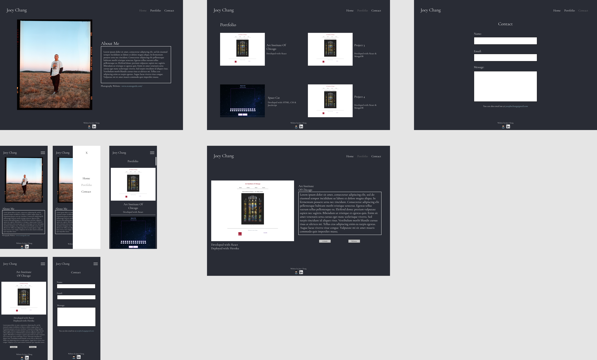

# Description

This is my first ever attempt to create a professional portfolio website for myself (Joey Chang). I was inspired to take a simpler approach with it to mesh well with who I am as a person. This portfolio represents me as a software engineer and also a photographer. Not forgetting where I came from.

## Tools I used

- React
- HTML
- CSS
- JavaScript

## Deployed on

- Netlify
- Heroku

## API used

https://jojos-portfolio.herokuapp.com/api/portfolios

## Link to the website

https://joeychang.netlify.app/

## Wireframes

